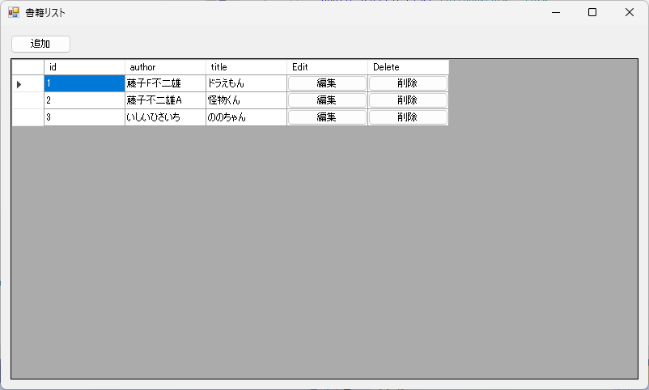

# Windowsフォームによるクライアント(C#)

- 本リポジトリで用意した API (http://localhost:8080/books/)に接続します
- 本の追加、編集、削除が可能です



実行方法

- 事前に API を起動する必要があります
    - ```npm run nodestart```


開発環境

- Visual Studio 2019
- .Net Framework 4.7.2

追加パッケージ

- System.Net.Http.Json
- System.Text.Json